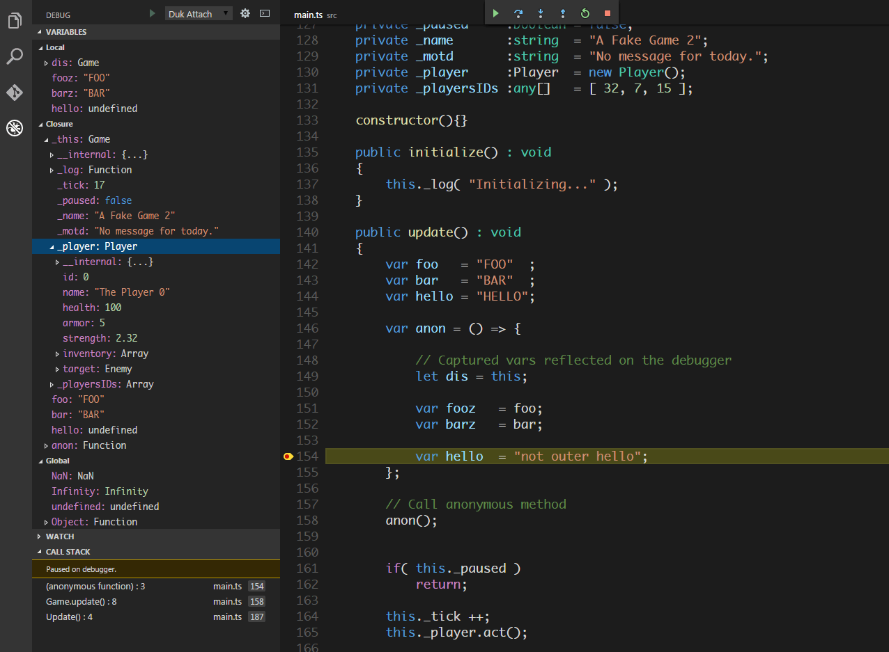

# VSCode Debugger for Duktape

[Duktape](https://github.com/svaarala/duktape) debug client for Visual Studio Code.

## Features
 - Local scope inspection (Duktape only provides local scope).
 - "this" object binding inspection.
 - Deep object inspection (nested objects).
 - Source map support. \**inlined currently unsupported*\*
 - Console input evals.
 - Artificial property inspection.
 
## Status
In working condition, but still in the process of being refactored and finalized. Not all options are not currently honored, and only attach mode is allowed.

## References
 - [https://code.visualstudio.com/docs/extensions/overview](https://code.visualstudio.com/docs/extensions/overview)
 - [https://code.visualstudio.com/docs/extensions/example-debuggers](https://code.visualstudio.com/docs/extensions/example-debuggers)

The adapter uses the debugger protocol based on Duktape version 1.5.0 of [debugger.rst](https://github.com/svaarala/duktape/blob/v1.5.0/doc/debugger.rst).

## Acknoledgements
Special thanks to Sami Vaarala for developing Duktape, and for freely sharing it with the community.
A "thank you" also to the VSCode team for facilitating their open-source IDE and the ability to easily make extensions for it.

This code contains portions borrowed or adapted from the [vscode nodeJS debugger](https://github.com/Microsoft/vscode-node-debug) and Sami Vaarala's web-based nodeJS [reference implementation](https://github.com/svaarala/duktape/tree/master/debugger) of a Dukatape debug client.

## License
[MIT](https://github.com/harold-b/vscode-duktape-debug/blob/master/LICENSE)

(c) Harold Brenes 2016

**Ἐμοὶ γὰρ, τὸ ζῆν Χριστὸς, καὶ τὸ ἀποθανεῖν, κέρδος.**